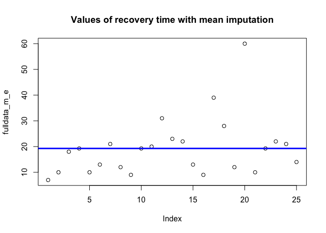
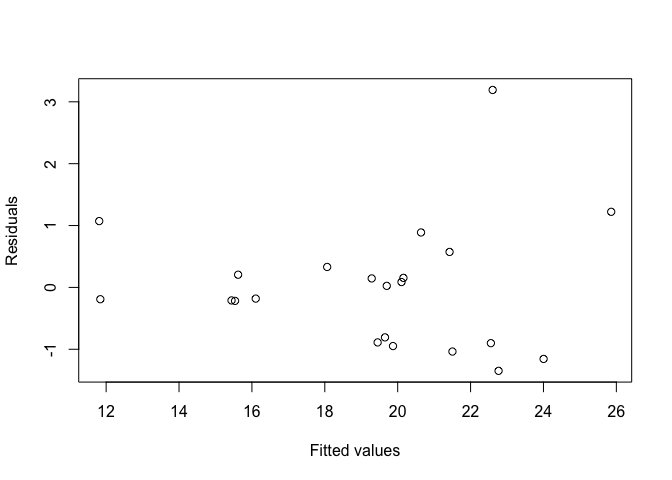
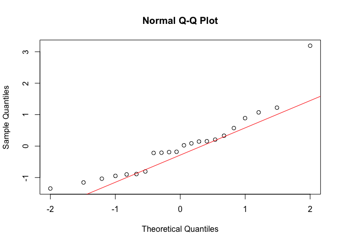

Incomplete Data Analysis
================
Stefanos Karageorgiou
10/28/2019

\#Main objectives of this project In this project the main goal is to
explore some of the easiest methods to handle missing data and compare
their performances. The methods that we are going to test under complete
case analysis are:<br/>

  - Mean imputation<br/>
  - Regression mean imputation<br/>
  - Stochastic regression imputation<br/>
  - Hot deck imputation (Predictive mean imputation)<br/>

**The data**<br/>

It is sometimes necessary to lower a patient’s blood pressure during
surgery, using a hy- potensive drug. Such drugs are administrated
continuously during the relevant phase of the operation; because the
duration of this phase varies, so does the total amount of drug ad-
ministered. Patients also vary in the extent to which the drugs succeed
in lowering blood pressure. The sooner the blood pressure rises again to
normal after the drug is discontinued, the better. The dataset, a
partial missing value version of the data presented by Robertson and
Armitage (1959), relate to a particular hypotensive drug and give the
time in minutes before the patient’s systolic blood pressure returned to
1000mm of mercury (the recovery time), the logarithm (base 10) of the
dose of drug in mil- ligrams (you can use this variable as is, no need
to transform it to the original scale), and the average systolic blood
pressure achieved while the drug was being administered.<br/>

``` r
head(databp)
```

    ##   logdose bloodp recovtime R
    ## 1    2.26     66         7 1
    ## 2    1.81     52        10 1
    ## 3    1.78     72        18 1
    ## 4    1.54     67        NA 0
    ## 5    2.06     69        10 1
    ## 6    1.74     71        13 1

**COMPLETE CASE ANALYSIS:**<br/>

\-Under complete case analysis the procedure that we follow is to
exclude the full row of data for any row containing missing value (in
our case in the column named “recovtime”). During the calculations we
will need an indicator of missingness. We will set a variable named
“indicator” which will will contain the position of the values that
are observed.<br/>

``` r
indicator=which(databp$R==1)
recov_mean=mean(databp$recovtime,na.rm=TRUE)
recov_se=sd(databp$recovtime,na.rm = TRUE)/sqrt(length(indicator))
recov_mean;recov_se
```

    ## [1] 19.27273

    ## [1] 2.603013

**Comment:**<br/> -Under complete case analysis the mean value of
recovery time is 19.27273 and the associated standard error is 2.603013.
<br/>

``` r
recov_logd_cor=cor(databp$recovtime[indicator],databp$logdose[indicator],method = "pearson")
recov_bp_cor=cor(databp$recovtime[indicator],databp$bloodp[indicator],method="pearson")
recov_logd_cor;recov_bp_cor
```

    ## [1] 0.2391256

    ## [1] -0.01952862

**Comment:**<br/> Under complete case analysis the correlation between
recovery time and logarithm of the dose of the drug using the Pearson
method is 0.2391256 and the correlation between recovery time and blood
pressure is -0.01952862. <br />

**Imputation methods**<br/>

<span style="color:blue">**1) Mean imputation**</span>

\-Mean imputation method fills all the missing data with the overall
mean of the observed ones. In our case we will fill the missing data of
recovery time with the mean of the observed ones. One feature of of mean
imputation is that the mean of the data remains the same (equal to the
mean of the observed data) after mean imputation.

``` r
fulldata_m_e=ifelse(databp$R==0,recov_mean,databp$recovtime)
bmean=mean(fulldata_m_e)
bse=sd(fulldata_m_e)/sqrt(length(fulldata_m_e))
bmean;bse
```

    ## [1] 19.27273

    ## [1] 2.284135

**Comment:**<br /> -Via mean imputation the mean value of recovery time
is 19.27273 (as expected) and the associated standard error is 2.284135.
The reason that standard error is smaller than before is that by filling
the missing data with the mean during the calculation of standard
diviation these imputed values will be the same as mean so their
difference is 0 so they dont change they dont change the sum of the
differences while the denominator became bigger.<br />

``` r
plot(fulldata_m_e,main="Values of recovery time with mean imputation")
abline(h = mean(fulldata_m_e), col="blue", lwd=3)
```

<!-- -->

``` r
b_recov_logd_cor=cor(fulldata_m_e,databp$logdose,method = "pearson")
b_recov_bp_cor=cor(fulldata_m_e,databp$bloodp,method="pearson")
b_recov_logd_cor;b_recov_bp_cor
```

    ## [1] 0.2150612

    ## [1] -0.01934126

**Comment:**<br /> After mean imputation the correlation between
recovery time and logarithm of the dose of the drug using the Pearson
method is 0.2150612 and the correlation between recovery time and blood
pressure is -0.01934126. <br />

<span style="color:blue">**2) Regression mean imputation**</span>

\-Regression mean imputation replaces each missing value with a
predicted conditional mean from a regression equation. To do so we will
fit the model only for observed values (complete case) and then predict
the values of recovery time missing meaning we will fill the missing
values with their predicted ones.<br />

The regression equation will be:
")
<br />

``` r
fits1=lm(recovtime~logdose+bloodp,data=databp)
summary(fits1)
```

    ## 
    ## Call:
    ## lm(formula = recovtime ~ logdose + bloodp, data = databp)
    ## 
    ## Residuals:
    ##     Min      1Q  Median      3Q     Max 
    ## -15.768 -10.250  -0.770   3.546  37.394 
    ## 
    ## Coefficients:
    ##             Estimate Std. Error t value Pr(>|t|)
    ## (Intercept)  15.2159    19.8203   0.768    0.452
    ## logdose      11.4290     8.4178   1.358    0.190
    ## bloodp       -0.2769     0.3411  -0.812    0.427
    ## 
    ## Residual standard error: 12.25 on 19 degrees of freedom
    ##   (3 observations deleted due to missingness)
    ## Multiple R-squared:  0.08879,    Adjusted R-squared:  -0.007129 
    ## F-statistic: 0.9257 on 2 and 19 DF,  p-value: 0.4134

**Comment:**<br /> -The estimated regression coefficients are
,
,
. <br /> -Before proceeding any further it
would be a good idea to check the linearity, homoscedasticity and
normality of the residuals. We will start by checking that the mean of
the residuals is close to 0 and also by calculating their variance so as
to see afterwards through a plot if the residuals have the same variance
(homoscedasticity).<br />

``` r
stdresiduals <- rstandard(fits1)
mean(fits1$residuals);var(fits1$residuals)
```

    ## [1] 9.386135e-16

    ## [1] 135.8298

As we can see the mean is indeed close to 0, 9.386135e-16 to be exact.
<br />

``` r
plot(fits1$fitted.values, stdresiduals, xlab = "Fitted values", ylab = "Residuals")
```

<!-- -->

\-As we can see the residuals are distributed without forming any
pattern almost evenly so we can assume that they hava the same variance.
Next we will check the assumption of normality.<br />

``` r
qqnorm(stdresiduals)
qqline(stdresiduals,col=2)
```

<!-- -->

  - As we can see almost all of our values lie in a straight line and do
    not form any curve, hence the normality is indeed true so we can now
    proceed with our linear regression.<br />

<!-- end list -->

``` r
prediction=predict(fits1,newdata = databp)
prediction[4];prediction[10];prediction[22]
```

    ##        4 
    ## 14.26254

    ##       10 
    ## 21.51562

    ##       22 
    ## 26.32896

``` r
fulldata_r_m_e=ifelse(databp$R==0,prediction,databp$recovtime)
cmean=mean(fulldata_r_m_e)
cse=sd(fulldata_r_m_e)/sqrt(length(fulldata_r_m_e))
cmean;cse
```

    ## [1] 19.44428

    ## [1] 2.312845

**Comment:**<br /> -After regression mean imputation the mean value of
recovery time is 19.44428 and the associated standard error is 2.312845.
<br />

``` r
c_rv_logd_cor=cor(fulldata_r_m_e,databp$logdose,method = "pearson")
c_rv_bp_cor=cor(fulldata_r_m_e,databp$bloodp,method="pearson")
c_rv_logd_cor;c_rv_bp_cor
```

    ## [1] 0.2801835

    ## [1] -0.0111364

**Comment:**<br /> After mean regression imputation the correlation
between recovery time and logarithm of the dose of the drug using the
Pearson method is 0.2801835 and the correlation between recovery time
and blood pressure is -0.0111364. <br />

<span style="color:blue">**3) Stochastic regression imputation**</span>

The stochastic regression imputation is bases in the same logic as
regression mean imputation with their difference being that in this case
we add noise to the predictions which results on our data being more
variable than before (referring to the case of regression mean
imputation case). In our regression equation now we add a random
variable z from a normal distribution with mean 0 and variance equal to
the estimated variance of the residuals.<br />

The equation of the predictions after adding noise will be:
")
where
 the standard diviation of the
residuals.<br />

**Comment:**<br /> In our case we need to remember that adding a noise
with variance around mean zero can result to negative predictions which
in our case are predictions associated with recovery time. So naturally
predictions with negative time do not make any sense. So in case we end
up with a negative prediction we should generate new ones with possitive
values. In our case after checking the predictions we see that all of
them are positive so there is no need to do any further actions.

``` r
set.seed(3)
prediction2=predict(fits1,newdata = databp)+rnorm(length(fulldata_r_m_e),0,sigma(fits1))
prediction2[4];prediction2[10];prediction2[22]
```

    ##         4 
    ## 0.1458566

    ##       10 
    ## 37.04426

    ##       22 
    ## 14.78327

``` r
fulldata_s_r_i=ifelse(databp$R==0,prediction2,databp$recovtime)
dmean=mean(fulldata_s_r_i)
dse=sd(fulldata_s_r_i)/sqrt(length(fulldata_s_r_i))
dmean;dse
```

    ## [1] 19.03894

    ## [1] 2.526795

**Comment:**<br /> -After stochastis regression imputation the mean
value of recovery time is 19.03894 and the associated standard error is
2.526795. <br />

``` r
d_rv_logd_cor=cor(fulldata_s_r_i,databp$logdose,method = "pearson")
d_rv_bp_cor=cor(fulldata_s_r_i,databp$bloodp,method="pearson")
d_rv_logd_cor;d_rv_bp_cor
```

    ## [1] 0.2924831

    ## [1] 0.02125841

**Comment:**<br /> After mean regression imputation the correlation
between recovery time and logarithm of the dose of the drug using the
Pearson method is 0.2924831 and the correlation between recovery time
and blood pressure is 0.02125841. <br />

<span style="color:blue">**4) Hot deck imputation (Predictive mean
imputation).**</span>

In general hot deck imputation implies that we replace a missing value
by replacing it randomly with one fully observed value which has the
same specified characteristics. In our case we will chose a donor based
on the one that has the prediction with the smallest squared difference
with the prediction of our missing data. In the following code we search
the minimum square difference between each observed value and our
missing value at a time. Following to that, we then seek the position of
the observed value which had the minimum prediction difference with the
prediction of our missing value. By locating the subject we then assign
its real value to the missing value. This process occurs 3 times (the
number of our missing values). One notice about the code is that in the
which function we get as a result a named integer. That is happening
because the original column of predictions has length 25 and we use it
in 2 pieces. So the which function returns the position of the
prediction in the original column as a name and then the value of the
current position(ie the position of the prediction if we had a column
only with predicitions of observed values meaning a column with a length
of 22). For example for the donor 4 we see that the closest prediction
is the one of the one with the position 6. However we ask the which
function to specify as which prediction of observed values is the one
that contirbutes to the minimum difference. So now the position 6 is 5
because the position 4 (which is missing value) is been excluded from
the column. Thus when we assign which we get a names integer with the
name 6(original position) and value 5(position after excluding missing
values) and that is why we then assign the numeric value of positions
name as the donor.

``` r
missingd=which(databp$R==0)
observed=which(databp$R==1)

min1=min((prediction[observed]-prediction[missingd][1])^2)
min1
```

    ## [1] 1.387919

``` r
position1=which((prediction[observed]-prediction[missingd][1])^2==min1)
donor4=as.numeric(names(position1))
donor4
```

    ## [1] 6

``` r
min2=min((prediction[observed]-prediction[missingd][2])^2)
min2
```

    ## [1] 0.0001781892

``` r
position2=which((prediction[observed]-prediction[missingd][2])^2==min2)
donor10=as.numeric(names(position2))
donor10
```

    ## [1] 2

``` r
min3=min((prediction[observed]-prediction[missingd][3])^2)
min3
```

    ## [1] 0.2211915

``` r
position3=which((prediction[observed]-prediction[missingd][3])^2==min3)
donor22=as.numeric(names(position3))
donor22
```

    ## [1] 17

``` r
fulldata_h_d=c(databp$recovtime[databp$R==1],databp$recovtime[donor4],databp$recovtime[donor10],databp$recovtime[donor22])

emean=mean(fulldata_h_d)
ese=sd(fulldata_h_d)/sqrt(length(fulldata_h_d))
emean;ese
```

    ## [1] 19.44

    ## [1] 2.464467

**Comment:**<br /> After using the method of predictive mean imputation
the minimum differences between missing value with the position 4 was
1.387919 and the position of the correspondant donor is 6. For the
missing value with position 10 the minimum squared difference was
0.0001781892 and the correspondant donor is 2. Finally the for missing
value with position 22 the minimum difference was 0.2211915 occuring
through the observed data of the one with the position 17. The resulting
mean of recovery time after using this method is 19.44 and the standard
error is 2.464467.<br />

**Comment:**<br /> Right now the order of our column recovery time is
not the same as before as we imputed the donor values at the end of the
list. That means that we cannot align the recovery time with other
columns with the recovery time being as it is. The correlation formula
of Pearson is in the form of :
 (y_{i}-\\overline{\\rm y})}{\\sqrt{\\sum_{i=1}^{n}(x_{i}-\\overline{\\rm x})^2\\sum_{i=1}^{n}(y_{i}-\\overline{\\rm y})^2}}"),
which verifies that we need to have our data ordered. So we will first
order our column and then calculate the correlations.

``` r
library(dplyr)
library(zoo)
```

``` r
fulldataordered=case_when(
  index(databp$recovtime)==4 ~ databp$recovtime[6],
  index(databp$recovtime)==10 ~ databp$recovtime[2],
  index(databp$recovtime)==22 ~ databp$recovtime[17],
  TRUE ~ databp$recovtime)

e_rv_logd_cor=cor(fulldataordered,databp$logdose,method = "pearson")
e_rv_bp_cor=cor(fulldataordered,databp$bloodp,method="pearson")
e_rv_logd_cor;e_rv_bp_cor
```

    ## [1] 0.3037945

    ## [1] -0.03208685

**Comment:**<br /> After predictive mean imputation the correlation
between recovery time and logarithm of the dose of the drug using the
Pearson method is 0.3037945 and the correlation between recovery time
and blood pressure is -0.03208685. <br />

<span style="color:blue">**Advantages and potentional problems of
predictive mean matching over stochastic regression imputation.**</span>

  - The main advantage we can clearly see versus stochastic regression
    imputation is that the imputations over this method are already
    observed values. That means that we will not have same problems with
    meaningless imputations that may occur in the stochastic method such
    as negative ones.<br />

  - A possible problem of predictive mean matching over a big data
    sample may occur in the case of a larger data set where our minimum
    difference for a missing value is found in more than one positions.
    As we can see above we chose to replace a missing value of recovery
    time which has logdose and bloodpressure values with one observed
    value with different characteristics. If we have more than one
    positions where we found the minimum difference then we are obliged
    by the hot deck method to chose one randomly. That may results to
    very different replacement of the missing value.<br/>

Thanks for reading\!
